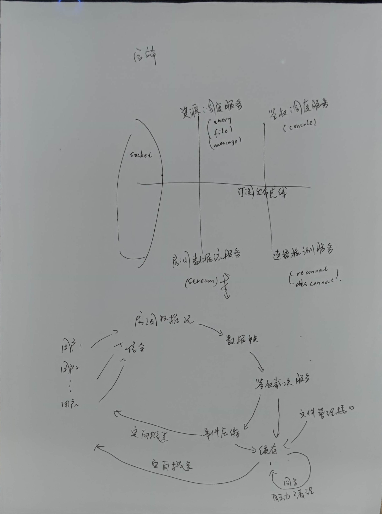
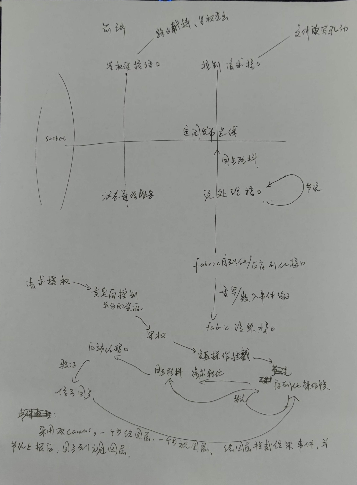

# faslipor

一款协同白板web应用

[TOC]

# 部署

​		在线链接1-vue3+nodejs后端(完整版demo)：http://faslipor.nodes-link.com

​		在线连接2-vue3+spring后端(由于工作量大，还有一小部分功能未完成)：http://spring.nodes-link.com

## 技术栈

​		前端：vue|vuex|vue router|element plus| fabric|socket.io

​		后端1：nodejs|socket.io|express

​		后端2：springboot|redis|netty-socketio

## 文件结构

​		build--存放打包结果、nginx-1.23.1内部配置windows下的nginx 双击run.bat即可运行

​		doc--存放相关技术文档

​		src--存放源码，其中包括spring后端、nodejs后端和vue3前端

## 技术架构

​		由于该系统对数据流的实时性要求较高，因此我们采用socket的方式封装私有协议进行高效的流转发。前端技术栈选择vue以及vue系列进行开发，难点有2，第一点是跨端操作的兼容性，受限于不同浏览器的

​		

