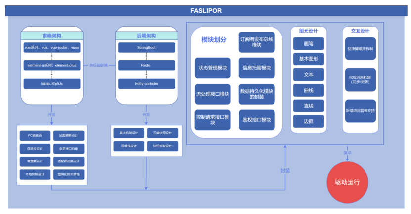
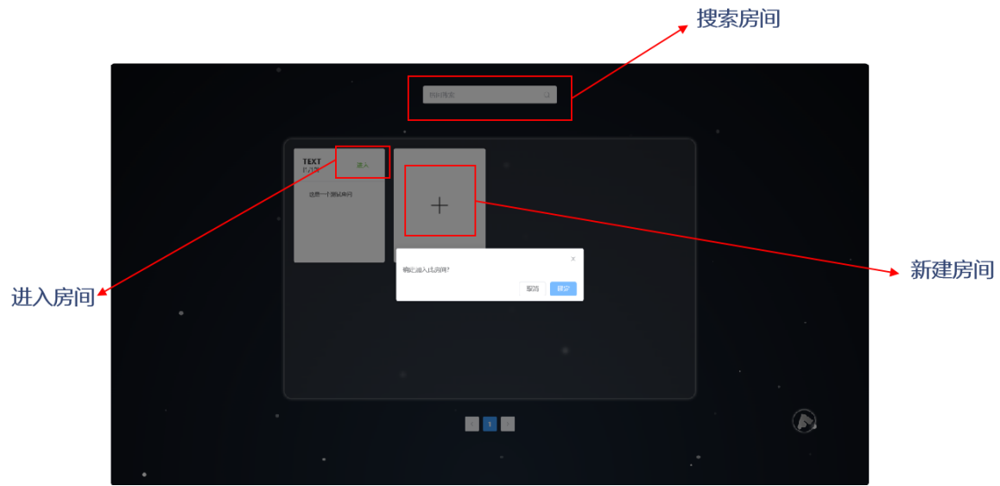
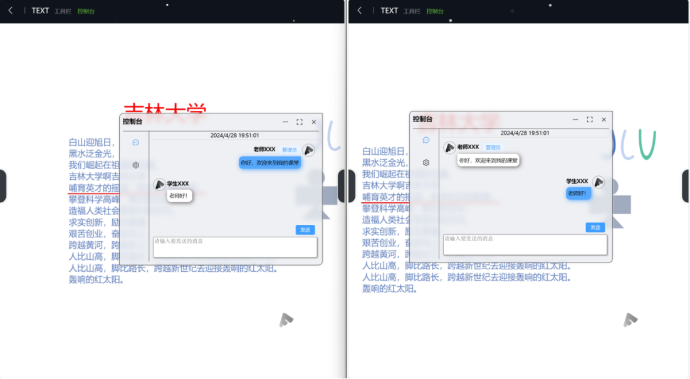
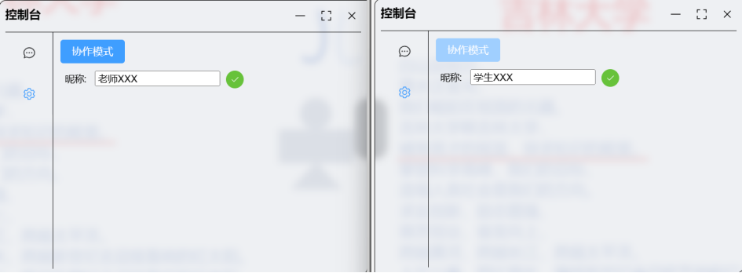
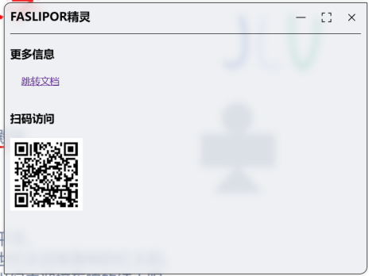
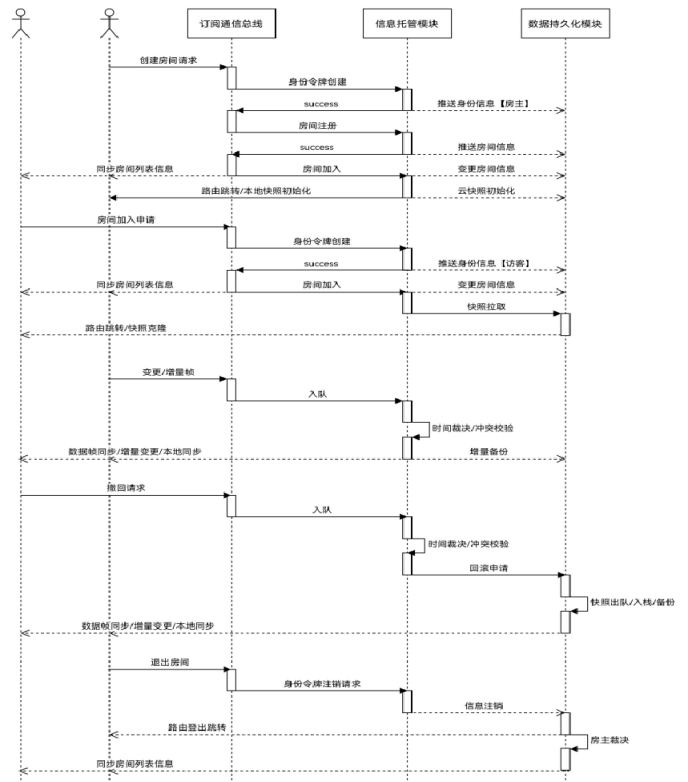
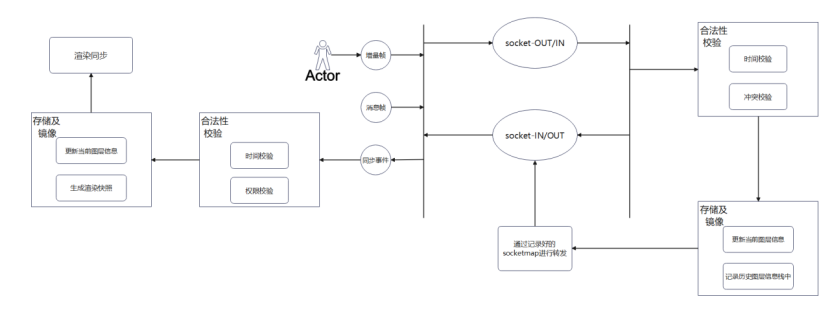
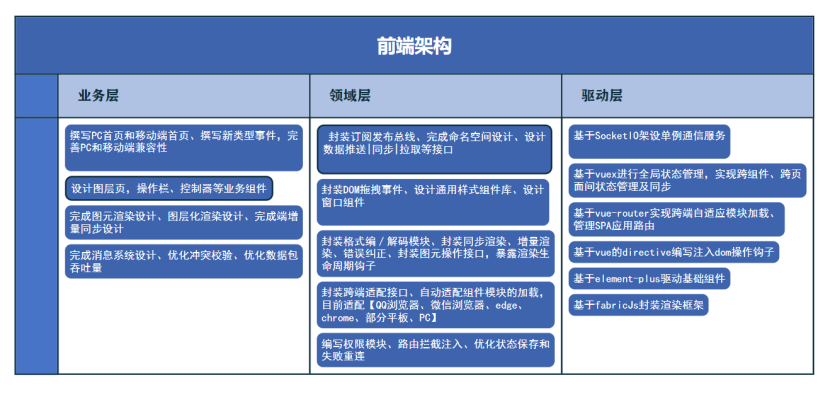

# FASLIPOR协同白板设计及使用说明书

## 一	需求分析

​	协同白板市场近年来呈现出快速增长的趋势，受到企业协作方式的变革和远程办公的推动，市场需求持续增长。协同白板作为一种新型的远程协作工具，已经成为众多企业和组织的首选，在模拟会议的过程中，协同白板的web平台使得不同的会议成员可以实时的记录和共享信息，有助于促进团队协作、创新和沟通效率提升。同时在教育领域中教育者可以通过协同白板实现跨时间、跨地点的教学协作，为学生提供更加互动化和个性化学习体验。随着数字化教育的不断推进，协同白板在教学中的应用将进一步深化，为教育行业带来更多的可能性与机遇。由此可见，协同白板软件市场充满了前景与活力。

​	目前市场上主流的协同白板软件虽然有着UI界面丰富、功能集成度高的特点，但这无形中，增加了使用学习成本，且这些软件都需要下载app,注册账号，对于协同编辑的使用者来说不够方便快捷。因此我们团队开发了一款***\*更轻量\****的***\*在线多人实时编辑\****的平台，在***\*浏览器上登录网址\****即可使用。利用网页版本的跨平台特性，可以轻松地将软件部署在各种设备上，***\*无需\****进行安装处理。同时我们开发的是静态网站，因此在初次加载后会自动缓存至本地，***\*降低\****再次访问的成本。目前主要支持的浏览器为edge 和 chrome。该平台涵盖了大部分的协同白板功能，产品的主体基调围绕黑白灰展开，操作追求***\*极致的高效与快捷\****，持续优化用户的交互体验，操作***\*简单\****，上手难度***\*较低\****。

竞品分析表

| ***\*产品\**** | ***\*平台\****      | ***\*是否需要账号\**** | ***\*费用\**** | ***\*协同编辑方式\**** | ***\*是否可以上传/下载白板文件\**** | ***\*入门难度\**** |
| -------------- | ------------------- | ---------------------- | -------------- | ---------------------- | ----------------------------------- | :----------------: |
| FASLIPOR       | 跨平台(HTML5)       | 否                     | 免费           | 网页共享               | 可以                                |        较低        |
| 腾讯会议       | Windows/Andriod/Ios | 是                     | ￥49/月        | 创建会议               | 只能下载                            |        较低        |
| 飞书文档       | Windows/Andriod/Ios | 是                     | ￥50/月        | 链接分享               | 不可以                              |        较高        |
| 语雀文档       | Windows/Andriod/Ios | 是                     | 免费           | 链接分享               | 不可以                              |        中等        |

## 二	概要设计

​	本软件的设计理念开发一款操作追求极致的高效与快捷，持续优化用户的交互体验的在线协同编辑白板，核心要点是【高效】。

​	对于高效我们表现在三个方面，首先是在架构选择上，我们希望符合高效高速迭代业务需求。前端架构我们选择使用Vue系列【vue、vue-router、vuex】+ element-ui系列【element-plus】+ fabricJS/p5Js,采用SPA应用进行业务支撑，结构化进行系统模块搭建，解耦全栈开发。在初期产品需求的迭代上看，采用vue进行开发能显著提效，开发者能更多的关注业务迭代减少很多0-1的底层赋能工作量。在后端架构上我们选择SpringBoot + Redis + Netty-socketio，采用java的SpringBoot进行服务端业务支撑，模块划分结构清晰， 采用Redis的实现IO吞吐优化以及承载容灾能力，进一步提升产品稳定性。对前后端架构的选择体现了本作品设计理念。

​	其次是用户角度，降低学习成本，快速上手产品使用是我们设计作品的初衷，本作品可以在网页登录使用，无需注册。在有限空间内部，以最简约的方式尽可能多地集成所有功能，界面素雅，可折叠工具栏进行维度收缩，获得更大的白板使用面积，系统提供了大量自适应操作与页面窗口进行高效交互，清晰简洁的图标按键可供用户快速上手进行编辑和交流，降低软件上手难度以及提高使用软件的效率。

​	最后是程序设计中，层层封装，逐级递进，从前端鉴权接口模块，状态管理模块，流处理接口模块，控制请求接口模块，到后端订阅者发布总线模块，信息托管模块，数据持久化模块的封装。采用微内核的思路，引擎的源码是可裁剪的，不会牵一发而动全身，体现了高内聚和低耦合的思想。在实际代码编写中，尽可能少地使用闭包，从而有效抑制内存泄漏，大量采用异步回调进行时序控制，降低CPU 的占用以及让前端响应无阻塞。同时我们精简了数据链路，以实现数据的高速同步。

## 三	使用说明

​	首先介绍房间登录界面，打开链接后，进入初始界面，如下图所示。正上方为搜索框，可搜索你想进入的房间。

​	点击+号，创建房间，可以更改房间名称，添加房间简介，添加房间密码，然后点击创建即可进入白板编辑界面。或者直接加入已经存在的房间，输入登录密码进入房间。

​	然后介绍白板编辑界面，如下图所示，软件一共分为四块区域。

 

​	区域一为工具栏，里面分为几个大类。工程类进行白板文件的保存，下载，打开，编辑白板过程中的撤回和取向撤回；图层类进行新的图层添加；形状类进行文字的编写，图形的编辑；样式表类用于展示当前编辑文字或图形的信息；更多信息类用于展示房间信息。

​	区域二为样式栏，可选中一个或多个图形，并修改图形的样式，比如线宽、线型、线色、填充色、字体、字号等，回滚/重做自己的最近编辑的内容(即Undo/Redo支持)，白板的当前内容移动、缩放、删除被选中的所有图形的功能。

​	区域三为控制台，消息日志里房间内用户可以进行消息的发送；房间设置里可以选择协作和只读两种模式(只有管理员可以修改模式)- 只读模式下，每个人都不能编辑，且前前页自动同步；在设置里也可以改变昵称，管理员有唯一的身份标识。

​	区域四为FASLIPOR悬浮精灵，可以打开进行一键式快捷操作和跳转查看本作品的使用说明。

## 四	详细设计及技术说明

### 4.1交互逻辑

​	如上面示意图所示，基本操作的交互逻辑涉及三大部分：订阅发布总线模块，信息托管模块和数据持久化模块。

​	每个请求的通用流程如下：

​	当一个用户发出请求时，他的请求由订阅发布总线路由到后端对应的事件，进而到达信息托管模块中相应的功能实现，该模块进行逻辑处理和相关校验以判断是否与持久化模块交互，如果信息合法，则同步持久化模块，并向总线发回响应。

​	增量帧请求是本项目的核心同步交互：本地和远端各自去维护一套快照，用户交互产生的增量帧先会被节流和注入时间戳，送至后端后在海量数据包里进行一个裁决，最后增量被同步至各个客户端，同时远端进行并行同步。增量帧同步至前端后，前端会对增量进行一个合并生效，生效前在各自的浏览器上进行一次本地裁决完成冲突校验，以防操作矛盾。

### 4.2关键技术

#### 4.2.1合法性校验

​	所有数据包通过Netty-socketio通信框架路由到对应的事件，然后进行相应的合法性校验，一般为2步：

​	1.时间校验：每个图元信息（json串）都带有一个时间戳，后端会记录被合法提交给redis的最后一个时间戳，以与该时间戳进行比对，如果时间落后于合法时间戳，那么说明当前图元为时间不合法图元，当即抛弃掉，否则进行下一步校验。

​	2.冲突校验：用户可能有冲突的操作。比如一个人在编辑一图元，另一人删掉它，此时如果编辑的信息后到达，在同步后，就会与编辑操作相冲突，为解决这一问题，我使用一个map记录所有被删除图元的id，每次收到时间校验通过的数据包时，查询其id是否在map中，以判断其是否冲突。

​	合法性校验全部通过后，提交到持久化模块，进行当前图层map里信息的合并，并将此map放入历史信息栈之中去，以便后续的撤回重做机制。

​	最后，将合法的图元进行房间内广播，以同步到房间内所有人的图层上。即路由到前端对应的事件，交付数据包，等待进一步的处理。

####  

#### 4.2.2解耦式模块设计

​	整个后端部分可整体性的被划分为三大部分：

##### 4.2.2.1订阅发布总线模块

​	承载模块间的无耦合通信，提供高效的命名空间管理的解决方案。将服务事件进行挂载，优化代码结构。

​	该模块主要依托netty-socketio通信框架建立，Socket.IO 是一个库，可以在客户端和服务器之间实现 低延迟, 双向 和 基于事件的 通信。它建立在 WebSocket 协议之上，并提供额外的保证，例如回退到 HTTP 长轮询或自动重新连接。前后端所有通信包通过在该框架中的自定义事件，实现相互间事件的订阅发布，以完成更好的功能解耦。

 

##### 4.2.2.2 信息托管模块

​	承载业务逻辑，提供socket管理、房间管理、用户管理、图层管理、快照管理、聊天管理等相关服务：

维护socket连接list，以重连或发送同步等消息，

​	维护房间信息，包含每个房间的用户信息，房间内图元信息，聊天信息等，我们在同步图元编辑信息时需要对每个房间的用户列表进行遍历，对redis和本地内存中的全量帧进行更改。

​	用户管理，即房间列表的信息管理及用户权限的管理。所有用户分为房主和普通用户，房主有权切换房间模式为协作模式或者只读模式。如果为后者，则所有人不能编辑任何图元。

​	每个用户可对当前房间内信息保存快照，导出为文件，这样保留了以后恢复房间内数据的条件。

​	每个房间被创建时，相当于自动创建了一个群聊，所有人可以在里面聊天。

 

##### 4.2.2.3 数据持久化模块

​	基于Redis的数据持久化技术方案，提升服务容灾能力，实现服务重启而不丢数据，提升数据安全性和稳定性。本项目所有重要和大体量的信息保存在redis中，比如房间图元信息，聊天信息等等。

​	由于redis具有rdb和aof的存储机制，帮助我们成功实现服务不丢数据的崩溃重启。

​	在本项目中采用的redis数据结构为string，把对象信息转为string后存储在redis中。

#### 4.3存储逻辑

​	在程序执行过程，可能会遇到大量图元存储在内存单元的情况，这时候，简明扼要的逻辑是必不可少的，首先是主体用户具有ID和权限属性，一个用户隶属于n个信息，n个用户对应一个房间（为避免服务器压力过大，这里我们设置上限为10），同时，n个具有时间和内容属性的消息主体包括于一个房间。这时，一个房间可以包括n个图层，每个图层又包括n个具有ID、缩放属性、位置坐标、旋转因子、类型为属性的图层对象，同时还与具有线宽、线颜色、填充颜色属性的画笔一一对应，包含于图层。

