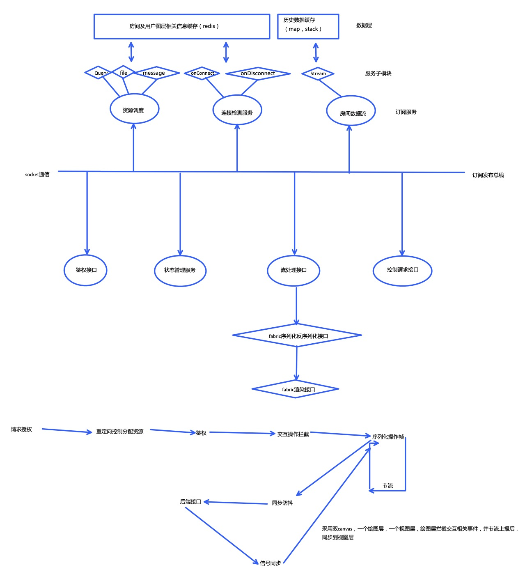

[TOC]

# 技术栈

​		前端：vue|vuex|vue-router|element-plus| fabric|vue-socket.io

​		后端：springboot|redis|netty-socketio
 使用redis做缓存，高速存取。使用netty-socketio，高性能的网络通信框架，基于Netty。

# 架构设计

模块分工：
后端：孙晓祺  资源调度模块  连接检测模块  房间数据流模块
前端：曾柏滔  鉴权接口模块 状态管理模块 流处理接口模块 控制请求接口模块

后端分别监听前端的三大类事件，资源调度事件，连接检测事件，房间数据流事件。由此划分子服务来为这些事件提供数据。
前端分别监听后端的控制请求事件，流事件，文件事件等，由此划分服务渲染图层并将图层及房间等相关信息发送给后端。

# 当前的进度

1.每个人都可以匿名加入白板(通过id)、快速创建白板  √
2.类似腾讯会议的加入会议、快速会议  √
3.每个白板默认只有一页(图形实际画在页上)，但可以添加新页 √ 
4.类似Excel的添加新Sheet  √
5.每个人可以在白板某页上创建各类图形，并被其他人实时看到 √
6.图形类型:直线、矩形、椭圆、自由曲线、文本等(看你还能想到哪些) √
7.白板有协作和只读两种模式(只有白板创建者可以修改模式)- 
只读模式下，每个人都不能编辑，且当前页自动同步√
高级功能
​        可选中一个或多个图形，并修改图形的样式，比如线宽、线型线色、填充色、字体、字号等√
​		移动、缩放、删除被选中的所有 图形√
​		回滚/重做自己的最近编辑的内容(即Undo/Redo支持)√
​		持导出白板的当前内容，也可导 入之前导出的内容√
​        可以在房间内进行相互间消息的发送

# 应用领域

课堂展示和讲演

会议讲演

# 适配

